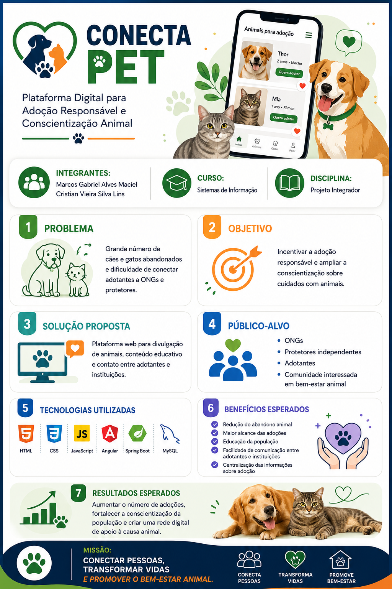

# CONECTA PET

Bem-vindo ao projeto CONECTA PET, uma plataforma simples e acolhedora para conectar pets em adoção a pessoas interessadas em dar um lar amoroso.

Este projeto foi desenvolvido como uma aplicação web estática com HTML, CSS e JavaScript, oferecendo uma experiência intuitiva para:

- explorar pets disponíveis para adoção;
- aplicar filtros por tipo, idade, tamanho e localização;
- salvar pets como favoritos;
- preencher um formulário para disponibilizar um pet para adoção.

## 📸 Visão Geral




## ✨ Funcionalidades

- Página inicial com chamada para adoção e disponibilização de pets
- Busca e filtros para encontrar o animal ideal
- Cards com informações principais de cada pet
- Modal de adoção com formulário de interesse
- Sistema de favoritos armazenado no navegador
- Formulário para cadastro de pets para adoção

## 🛠️ Tecnologias Utilizadas

- HTML5
- CSS3
- JavaScript
- Font Awesome para ícones

## 📁 Estrutura do Projeto

```text
CONECTA_PET/
├── assets/             # Imagens e recursos visuais do projeto
├── css/                # Estilos do site
├── js/                 # Lógica da aplicação
├── index.html          # Página principal
└── README.md           # Documentação do projeto
```

## ▶️ Como Executar

1. Clone o repositório:

```bash
git clone <url-do-repositorio>
```

2. Acesse a pasta do projeto:

```bash
cd CONECTA_PET
```

3. Abra o arquivo `index.html` em seu navegador.

> Como o projeto é uma aplicação estática, não é necessário instalar dependências adicionais.

## 🐾 Como Usar

- Na seção “Encontrar Pets”, você pode navegar pelos animais disponíveis e usar os filtros para refinar a busca.
- Clique em “Adotar” para visualizar mais detalhes do pet.
- Use o botão de estrela para marcar um pet como favorito.
- Na seção “Disponibilizar Pet”, preencha o formulário para anunciar um animal para adoção.

## 👥 Autores

- Marcos Gabriel Alves Maciel
- Cristian Vieira Silva Lins

## 📌 Observação

Este projeto foi desenvolvido com foco em uma experiência simples, visual e acessível para incentivar a adoção responsável de animais.
